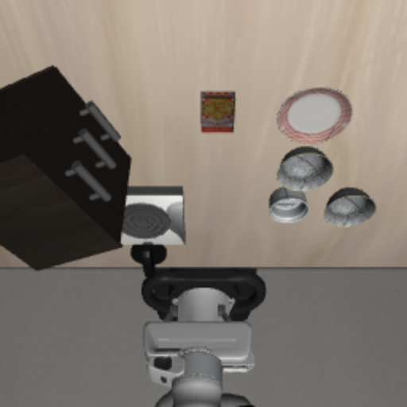
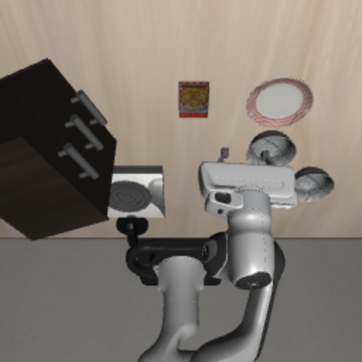
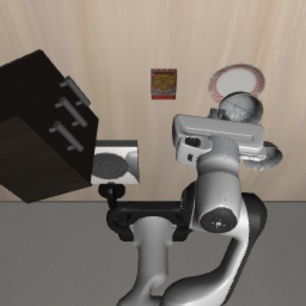
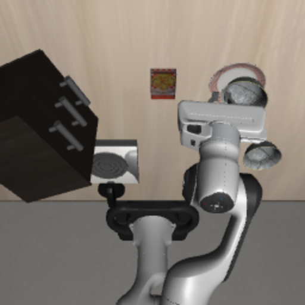

# Robot Agent MVP

LLM task decomposition + VLA execution in LIBERO tabletop simulation.

Human sends a natural language instruction via CLI. The LLM agent decomposes it into subtasks (PRAE loop), and a VLA model (OpenPI pi0) executes each subtask in MuJoCo simulation.

## Demo: Pick-and-Place in LIBERO

> Task: *"pick up the black bowl between the plate and the ramekin and place it on the plate"*

| Initial Scene | Reaching (step 50) | Grasping (step 100) | Task Complete (step 139) |
|:-:|:-:|:-:|:-:|
|  |  |  |  |

**Pipeline**: Gemini 2.5 Flash (task decomposition) -> OpenPI pi0 VLA (motor control @ 10Hz, replan every 5 steps) -> LIBERO MuJoCo (physics simulation)

## Architecture

```
CLI ──► Agent Core (nanobot) ──► LLM (task decomposition)
              │                        │
              │                   ┌────┴────┐
              ▼                   ▼         ▼
         Robot Tools          Perceive   Reason
         (10 tools)           (VLM)     (plan)
              │                              │
              ▼                              ▼
        LoopManager ◄── Route Config ◄── Difficulty
              │
              ▼
     VLA Adapter ──► Safety ──► Env (LIBERO / Mock)
     (predict)      (clamp)    (step)
```

**Three-layer abstraction:**

| Layer | Responsibility | Frequency |
|-------|---------------|-----------|
| Intention | Intent recognition, slot extraction | 50-800ms |
| Cognition | Task planning + optional perception (VLM) | 0.5-10s |
| Action | VLA control loop + safety checks | 2-20Hz |

## Quick Start

```bash
# Install (requires nanobot from parent repo)
pip install -e ../../../nanobot
pip install -e ".[dev]"

# Run tests (no GPU needed)
pytest tests/ -v

# Interactive mode (mock env, mock VLA)
robot-agent agent --env mock --vla mock

# Single message mode
robot-agent agent -m "put both the alphabet soup and the tomato sauce in the basket"

# With OpenPI VLA + LIBERO simulation (requires GPU + openpi server running)
MUJOCO_GL=egl robot-agent agent --env libero --vla websocket --vla-port 8000 \
  --task "libero_spatial:0" \
  -m "pick up the black bowl between the plate and the ramekin and place it on the plate"
```

## Project Structure

```
robot-agent-mvp/
├── config/
│   ├── agent.json              # LLM provider config (local vLLM)
│   └── routes.yaml             # easy/hard routing parameters
├── workspace/
│   ├── IDENTITY.md             # Agent persona + PRAE loop instructions
│   └── TOOLS.md                # Tool usage guidance for LLM
├── src/robot_agent/
│   ├── cli.py                  # Entry point: robot-agent command
│   ├── context.py              # RobotContext (shared state)
│   ├── env/
│   │   ├── base.py             # RobotEnv ABC
│   │   ├── mock.py             # MockEnv (stateful, no GPU)
│   │   └── libero.py           # LiberoEnv (MuJoCo simulation)
│   ├── vla/
│   │   ├── base.py             # VLAAdapter ABC
│   │   ├── mock.py             # MockVLAAdapter (random actions)
│   │   ├── http.py             # HTTPVLAAdapter (remote VLA server)
│   │   └── websocket.py        # WebSocketVLAAdapter (OpenPI msgpack)
│   ├── loop.py                 # LoopManager (asyncio control loops)
│   ├── termination.py          # StepLimit + PositionThreshold
│   ├── safety.py               # E-Stop + velocity clamp
│   ├── routing.py              # Route config (easy/hard)
│   └── tools/                  # 10 robot tools (nanobot Tool ABC)
│       ├── look.py             # Scene capture + VLM analysis
│       ├── move.py             # Move end-effector
│       ├── grasp.py            # Open/close gripper
│       ├── perceive.py         # Deep perception analysis
│       ├── subtask.py          # start_subtask, check_loops, wait_subtask
│       ├── safety.py           # emergency_stop
│       └── model_mgmt.py       # model_health, model_ensure
└── tests/                      # 32 tests, all pass without GPU
```

## Tools

| Tool | Description |
|------|-------------|
| `look` | Capture scene image + VLM analysis (or formatted observation in mock mode) |
| `move` | Move end-effector to target position |
| `grasp` | Open/close gripper |
| `perceive` | Deep perception analysis for a specific goal |
| `start_subtask` | Launch async VLA control loop for a subtask |
| `check_loops` | Query status of all running/completed control loops |
| `wait_subtask` | Wait for a subtask to complete |
| `emergency_stop` | Immediately halt all motion (requires manual reset) |
| `model_health` | Check VLA + VLM + sim health status |
| `model_ensure` | Confirm all services ready before starting a task |

## PRAE Loop

The agent follows the **Prepare-Perceive-Reason-Act-Evaluate** loop:

1. **Prepare** - `model_ensure` confirms all services are ready
2. **Perceive** - `look` observes the scene
3. **Reason** - LLM decomposes task into subtasks, classifies difficulty
4. **Act** - `start_subtask` + `wait_subtask` executes each subtask via VLA
5. **Evaluate** - `look` verifies result, retries if needed (max 3)

## Verification Tasks

Two LIBERO-10 tasks validate LLM decomposition:

| Task | Pattern | Subtasks |
|------|---------|----------|
| "put both the alphabet soup and the tomato sauce in the basket" | Repeat | pick soup → place → pick sauce → place |
| "put the black bowl in the bottom drawer of the cabinet and close it" | Chain | open drawer → pick bowl → place in drawer → close drawer |

## Design

- **Nanobot reuse**: AgentLoop, ToolRegistry, ContextBuilder, MemoryStore, SkillsLoader, SubagentManager, LLMProvider used as-is. Zero lines modified.
- **Extension only**: Robot tools registered via `register_robot_tools(registry, ctx)`.
- **RobotContext**: Single shared-state dataclass injected into all tools. No globals.
- **Asyncio-first**: LoopManager runs VLA control loops as asyncio tasks. Blocking VLA calls wrapped with `asyncio.to_thread()`.
- **Dual mode**: MockEnv for development (no GPU), LiberoEnv for real simulation.
